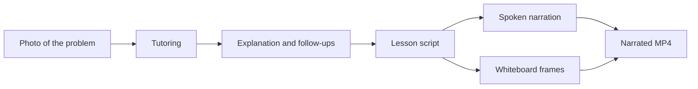

# Math Tutor

Upload a photo of a math problem, get an explanation matched to the problem's level, ask follow-up questions, and generate a narrated whiteboard lesson.

## What it does

- Reads a photographed equation or word problem with GPT-4.1 mini
- Infers the learner's level from the problem and explains in matching language
- Answers follow-up questions in chat, with LaTeX rendered in the page
- Turns the lesson into a short narrated MP4

## Architecture

The app is one Streamlit process with three layers: an interface, a tutoring layer, and a renderer. 

```
Interface     Streamlit: upload, chat, playback, session state
Tutoring      OpenAI: read the photo, explain, follow up, speak
Rendering     Pillow whiteboard frames + MoviePy/FFmpeg MP4
Output        runtime/videos/
```



## Setup

```bash
python -m venv .venv
source .venv/bin/activate
pip install -r requirements.txt
export OPENAI_API_KEY="your-key"
streamlit run app.py
```

You can also paste the API key in the environment before starting Streamlit. Generated videos are written under `runtime/videos/`.

Image explanations, follow-ups, and narration all use the OpenAI API, so video generation can take a minute and incurs usage.

## How a session works

1. Upload a PNG, JPG, JPEG, or WebP of the problem.
2. Click **Explain this problem**.
3. Ask follow-ups if a step was unclear or the image was misread.
4. Click **Generate video** to render a classroom-style lesson with spoken narration.

## Demo


https://github.com/user-attachments/assets/9d2be673-e51d-4bb6-9183-a3f64b6ad728

